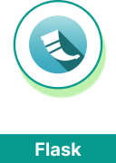
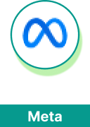
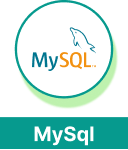
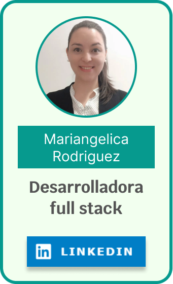
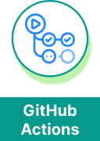
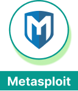
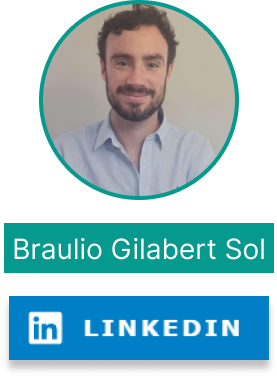

<picture>
  <source media="(prefers-color-scheme: dark)" srcset="./assets/banner_sol7_dark.png">
  <source media="(prefers-color-scheme: light)" srcset="./assets/banner_sol7_ligth.png">
  
</picture>

 

Cambiar a:&nbsp; &nbsp; 

---

# Desafío de tripulaciones
Se trata de un proyecto de fin de curso, desarrollado por profesionales de: **Diseño de producto UX UI**, **ciberseguridad**, **data science**, **desarrollo web full stack**, **marketing digital** y **cloud/devOps**; con la finalidad solucionar una problemática planteada en un brief (informe) y poner en valor la expertise de cada área.

 

  &nbsp; &nbsp;
  &nbsp; &nbsp;
  &nbsp; &nbsp;
  &nbsp; &nbsp;
  &nbsp; &nbsp;
  &nbsp; &nbsp;

## Objetivos
- **Resolución de problemas** complejos.
- Trabajar con **metodologías ágiles**, en una situación de trabajo realista con equipos multidisciplinares
- Desarrollo de un proyecto bajo la presión de deadlines (fechas de entrega) y la presentación del proyecto ante un jurado

 

## Proceso
Se divide en 3 grandes fases
  1. Investigación:  
    Dirigida por los profesionales de Diseño de producto UX/UI, aplicando metodologías como **Design Thinking** y **scrum**.
  2. Producción:  
    Dónde los especialistas de ciberseguridad, data science y desarrollo web full stack, trabajan en conjunto para **desarrollar**, **securizar** y **manejar los datos** de la aplicación hasta llevarla a producción.
  3. Campañas:   
    Profesionales de marketing plantean las **campañas publicitarias** para conseguir que el producto final sea **viable** y **comercial**.

 

## Áreas profesionales implicadas

  
&nbsp; &nbsp;&nbsp; &nbsp; Diseño de producto UX/UI

 

  

  

  ### Responsabilidades

  - Investigación inicial
  - Diseño de flujos
  - Desarrollo del prototipado
  

  

  ### Herramientas

  

    &nbsp; &nbsp;
    &nbsp; &nbsp;
  

  

  

  ### Profesionales

  

---

  
&nbsp; &nbsp; &nbsp; &nbsp; Data Science

 

  

  

  ### Responsabilidades

  - Recopilación de datos (investigación)
  - Creación de un asistente virtual UX/UI
  - Creación de un modelo de predicción
  

  

  ### Herramientas

  

    &nbsp; &nbsp;
    &nbsp; &nbsp;
    &nbsp; &nbsp;
    &nbsp; &nbsp;
    &nbsp; &nbsp;
  

  

  

  ### Profesionales

  

  

  

  

---

  
&nbsp; &nbsp; &nbsp; &nbsp; Marketing digital

  
 

  

  

  ### Responsabilidades

  - Desarrollo del Modelo de Negocio
  - Diseño de las campañas publicitarias
  - Planificación analítica 
  

  

  ### Herramientas

  

    &nbsp; &nbsp;
    &nbsp; &nbsp;
    &nbsp; &nbsp;
    &nbsp; &nbsp;
    &nbsp; &nbsp;
    &nbsp; &nbsp;
  

  

  

  ### Profesionales

  

---

  
&nbsp; &nbsp; &nbsp; &nbsp; Desarrollo web Full Stack

  
 

  

  

  ### Responsabilidades

  - Desarrollo del Frontend con React
  - Desarrollo de Backend con Express
en NodeJS
  -  BBDD relacional en MySQL
  

  

  ### Herramientas

  

    &nbsp; &nbsp;
    &nbsp; &nbsp;
    &nbsp; &nbsp;
    &nbsp; &nbsp;
    &nbsp; &nbsp;
    &nbsp; &nbsp;
  

  

  

  ### Profesionales

  

  

---

  
&nbsp; &nbsp; &nbsp; &nbsp; Cloud & devOps

    
 

  

  

  ### Responsabilidades

  - Diseño de arquitectura para automatización sistemas
  - Sincronización automática de versiones
  - Despliegue de sistemas y aplicación 
  

  

  ### Herramientas

  

    &nbsp; &nbsp;
    &nbsp; &nbsp;
    &nbsp; &nbsp;
    &nbsp; &nbsp;
    &nbsp; &nbsp;
    &nbsp; &nbsp;
    &nbsp; &nbsp;
  

  

  

  ### Profesionales

  

---

  
&nbsp; &nbsp; &nbsp; &nbsp; Ciberseguridad

    
 

  

  

  ### Responsabilidades

  - Desarrollo del Modelo de Negocio
  -  Diseño de las campañas publicitarias
  - Planificación analítica 
  

  

  ### Herramientas

  

    &nbsp; &nbsp;
    &nbsp; &nbsp;
    &nbsp; &nbsp;
    &nbsp; &nbsp;
    &nbsp; &nbsp;
    &nbsp; &nbsp;
  

  

  

  ### Profesionales

  

  

  

  

 

## Herramientas de trabajo y comunicación

  

  

  

  ### Slack
  
  - Comunicación entre integrantes del equipo
  - Compartir información
  - Estar al día de las comunicaciones generales de la escuela

  

  

  

  

  

  ### Discord

  - Reuniones entre integrantes
  - Compartir información a todo el equipo
  - Comunicación entre integrantes del equipo
  

  

  

  

  

  ### Trello

  - Planificación y actualización de actividades con el método "kanban"
  - Conocer el estado de todos los componentes del proyecto
  - Saber en que está trabajando cada integrante
  

  

  

  

  

  ### Google meet

  - Dailies (Reuniones diarias de todo el equipo dirigidas por el Scrum Master)
  - Sprint review (Reunión retrospectiva del sprint)
  

  

  
  

  

  

  ### Github

  - Desarrollo de la app y control de versiones
  - Hacer pruebas de los cambios, previo a desplegarlos
  - Sincronización de despliegue de la aplicación
  

  

## Colaboradores

### Mentores

  

  ### Mentor & Scrum master

  Encargado de representar al equipo como mentor ante la escuela y desempeñar las funciones de Scrum master

 

  
  

  ### Mentor Diseño de producto UX/UI

  Designado a la mentoría de la profesional de Diseño UX/UI

 

### Profesionales

  

  

  

  

  

  
  
  

  

  

  
  
  

  

---

  

