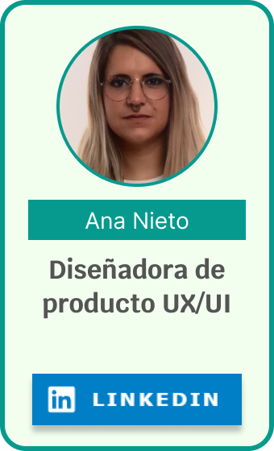

<picture>
  <source media="(prefers-color-scheme: dark)" srcset="./assets/banner_sol7_dark.png">
  <source media="(prefers-color-scheme: light)" srcset="./assets/banner_sol7_ligth.png">
  
</picture>

 

Cambiar a:&nbsp; &nbsp; 

---

# Desafío de tripulaciones
Se trata de un proyecto de fin de curso, desarrollado por profesionales de: UX UI Digital Product Design, Ciberseguridad, Data Science, Desarrollo Web full stack, marketing digital y Cloud/devOps; con la finalidad solucionar una problemática planteada en un brief (informe) y poner en valor la expertise de cada área.

 

  &nbsp; &nbsp;
  &nbsp; &nbsp;
  &nbsp; &nbsp;
  &nbsp; &nbsp;
  &nbsp; &nbsp;
  &nbsp; &nbsp;

## Objetivos
- Resolución de problemas complejos.
- Trabajar con metodologías ágiles, en una situación de trabajo realista con equipos multidisciplinares
- Desarrollo de un proyecto bajo la presión de deadlines (fechas de entrega) y la presentación del proyecto ante un jurado

 

## Proceso
Se divide en 3 grandes fases
  1. Investigación:  
    Dirigida por los profesionales de Diseño de produto UX/UI, aplicando metodologías como Design Thinking y scrum.
  2. Producción:  
    Dónde los especialistas de Ciberseguridad, Data Science y Desarrollo Web full stack, trabajan en conjunto para desarrollar, securizar y manejar los datos de la aplicación hasta llevarla a producción.
  3. Campañas:   
    Profesionales de marketing plantean las campañas publicitarias para conseguir que el producto final sea viable y comercial.

 

## Áreas profesionales implicadas

  
&nbsp; &nbsp;&nbsp; &nbsp; Diseño de produto UX/UI

 

  

  

  ### Responsabilidades

  - Investigación inicial
  - Diseño de flujos
  - Desarrollo del prototipado
  

  

  ### Herramientas

  

    &nbsp; &nbsp;
    &nbsp; &nbsp;
  

  

  

  ### Profesionales

  

  

---

  
&nbsp; &nbsp; &nbsp; &nbsp; Data Science

 

  

  

  ### Responsabilidades

  - Recopilación de datos (investigación)
  - Creación de un asistente virtual UX/UI
  - Creación de un modelo de predicción
  

  

  ### Herramientas

  

    &nbsp; &nbsp;
    &nbsp; &nbsp;
    &nbsp; &nbsp;
    &nbsp; &nbsp;
    &nbsp; &nbsp;
  

  

  

  ### Profesionales

  

  

  

  

---

  
&nbsp; &nbsp; &nbsp; &nbsp; Marketing digital

---

  
&nbsp; &nbsp; &nbsp; &nbsp; Desarrollo web Full Stack

---

  
&nbsp; &nbsp; &nbsp; &nbsp; Cloud & devOps

---

  
&nbsp; &nbsp; &nbsp; &nbsp; Ciberseguridad

 

## Colaboradores

  

---

  