<picture>
  <source media="(prefers-color-scheme: dark)" srcset="./assets/content.en/banner_sol7_dark_en.png">
  <source media="(prefers-color-scheme: light)" srcset="./assets/content.en/banner_sol7_ligth_en.png">
  
</picture>

 

Cambiar a:&nbsp; &nbsp; 

---

# Desafío de tripulaciones
This is an end-of-course project, developed by professionals from: **UX UI product design**, **cybersecurity**, **data science**, **full stack web development**, **digital marketing** and **cloud/devOps**; in order to solve a problem raised in a brief and value the experience of each area.
 

  &nbsp; &nbsp;
  &nbsp; &nbsp;
  <a href="#áreas-profesionales-implicadas">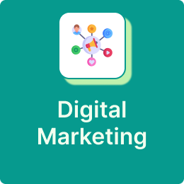</a>&nbsp; &nbsp;
  &nbsp; &nbsp;
  &nbsp; &nbsp;
  &nbsp; &nbsp;

## Goals
- Complex **problem solving**
- Work with **agile methodologies**, in a realistic work situation with multidisciplinary teams
- Development of a project under the pressure of deadlines and the presentation of the project before a jury

 

## Process

It is divided into 3 major phases
  1. Investigation:  
    Directed by UX UI product design professionals, applying methodologies such as Design Thinking and scrum.Directed by UX UI product design professionals, applying methodologies such as **Design Thinking** and **scrum**.
  2. Production:  
    Where cybersecurity, data science and full stack web development specialists work together to **develop**, **secure** and **manage the application data** until it is put into production.
  3. Campaigns:   
    Marketing professionals plan **advertising campaigns** to ensure that the final product is **viable** and **commercial**.

 

## Professional areas involved

  
&nbsp; &nbsp;&nbsp; &nbsp; UX UI product design

 

  

  

  ### Responsabilities

  - Initial search
  - Flow design
  - Prototyping development
  

  

  ### Tools

  

    &nbsp; &nbsp;
    &nbsp; &nbsp;
  

  

  

  ### Professionals

  

---

  
&nbsp; &nbsp; &nbsp; &nbsp; Data Science

 

  

  

  ### Responsibilities

  - Data collection
  - Creation of a UX/UI virtual assistant
  - Creation of a prediction model
  

  

  ### Tools

  

    &nbsp; &nbsp;
    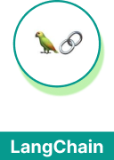&nbsp; &nbsp;
    &nbsp; &nbsp;
    &nbsp; &nbsp;
    &nbsp; &nbsp;
  

  

  

  ### Professionals

  

  

  

  

---

  
&nbsp; &nbsp; &nbsp; &nbsp; Digital Marketing

  
 

  

  

  ### Responsibilities

  - Business Model Development  
  - Design of advertising campaigns  
  - Analytical planning 
  

  

  ### Tools

  

    &nbsp; &nbsp;
    &nbsp; &nbsp;
    &nbsp; &nbsp;
    &nbsp; &nbsp;
    &nbsp; &nbsp;
    &nbsp; &nbsp;
  

  

  

  ### Professionals

  

---

  
&nbsp; &nbsp; &nbsp; &nbsp; 
Full Stack Web Development

  
 

  

  

  ### Responsibilities

  - Frontend development with React
  - Backend development with Express
in NodeJS
  - Relational database in MySQL
  

  

  ### Tools

  

    &nbsp; &nbsp;
    &nbsp; &nbsp;
    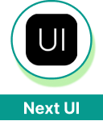&nbsp; &nbsp;
    &nbsp; &nbsp;
    &nbsp; &nbsp;
    &nbsp; &nbsp;
  

  

  

  ### Professionals

  

  

---

  
&nbsp; &nbsp; &nbsp; &nbsp; Cloud & devOps

    
 

  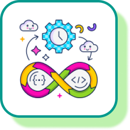

  

  ### Responsibilities

  - Architecture design for automation systems
  - Automatic version synchronization
  - Systems and application deployment
  

  

  ### Tools

  

    &nbsp; &nbsp;
    &nbsp; &nbsp;
    &nbsp; &nbsp;
    &nbsp; &nbsp;
    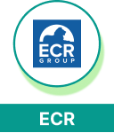&nbsp; &nbsp;
    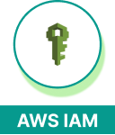&nbsp; &nbsp;
    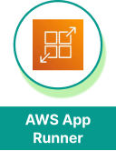&nbsp; &nbsp;
  

  

  

  ### Professionals

  

---

  
&nbsp; &nbsp; &nbsp; &nbsp; cybersecurity

    
 

  

  

  ### Responsibilities

  - Business Model Development
  - Design of advertising campaigns
  - Analytical planning
  

  

  ### Tools

  

    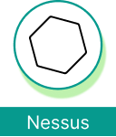&nbsp; &nbsp;
    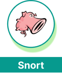&nbsp; &nbsp;
    &nbsp; &nbsp;
    &nbsp; &nbsp;
    &nbsp; &nbsp;
    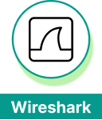&nbsp; &nbsp;
  

  

  

  ### Professionals

  

  

  

  

 

## Work and communication tools

  

  

  

  ### Slack
  
  - Communication between team members
  - Share information
  - Stay up to date with general school communications

  

  

  

  

  

  ### Discord
  
  - Meetings between members
  - Share information to the whole team
  - Communication between team members
  

  

  

  

  

  ### Trello

  - Planning and updating of activities with the "kanban" method
  - Know the status of all project components
  - Know what each member is working on
  

  

  

  

  

  ### Google meet

 
  - Dailies (Daily meetings of the entire team led by the Scrum Master)
  - Sprint review (Retrospective meeting of the sprint)
  

  

  
  

  

  

  ### Github
  
  - App development and version control
  - Test the changes before deploying them
  - Application deployment synchronization
  

  

## Collaborators

### Mentors

  <a href="https://github.com/Guille-Rubio">
    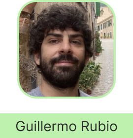
  </a>

  ### Mentor & Scrum master

In charge of representing the team as a mentor in the school and performing the functions of Scrum master

 

  <a href="https://www.linkedin.com/in/yvanargos/">
    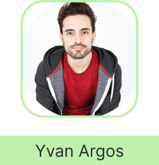
  </a>
  

  ### UX/UI Product design mentor

  Designated to mentor the UX/UI Design professional

 

### Professionals

  

  <a href="www.linkedin.com/in/annita-nino">
    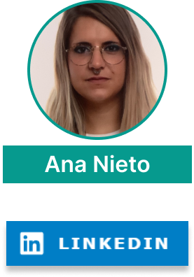
  </a>

  

  

  

  
  
  

  

  <a href="https://github.com/JorgeMonterde">
    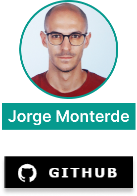
  </a>

  
  
  

  

---

  